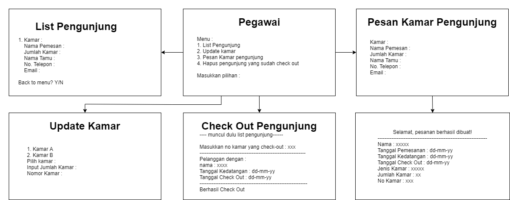

# Sistem Reservasi Hotel

Anggota Kelompok:
* Rafa Azka Ulinnuha (140810200033)
* Amalia Nur Fitri (140810200045)
* Kharisma Fitri Nurunnnisa Siahaan (140810200047)
---

## Latar Belakang

Hotel adalah suatu tempat yang dipergunakan untuk keperluan menginap dan keperluan lainnya seperti acara pertemuan atau pernikahan. Reservasi adalah fungsi yang melaksanakan pelayanan pemberian informasi mengenai pemesanan kamar, pemesanan tempat mengadakan suatu acara, dan penyedia sarana pendukung lainnya kepada masyarakat.

Hotel Del Luna adalah suatu perusahaan yang bergerak dibidang perhotelan dan berlokasi di kota Bulan. Hotel ini sedang berkembang dan selalu berupaya mengedepankan pelayanan, keamanan, dan kenyamanan bagi tamu atau pengunjung. Saat ini Hotel Del Luna masih menggunakan sistem manual dan belum menggunakan teknologi yang terkomputerisasi. Jadi untuk melakukan reservasi, pengunjung harus mendatangi hotel secara langsung atau melakukan reservasi via telepon untuk mengetahui ketersediaan kamar dan memesan kamar. Selain itu, sering terjadi kesalahan dalam penginputan data. Kesalahan ini dapat merugikan pengunjung dan juga pihak hotel.

Oleh karena itu, dibutuhkan suatu program sistem pengolahan data reservasi hotel yang sudah terkomputerisasi, sehingga dapat mempermudah pihak hotel dalam penginputan dan pengolahan data. Selain itu pula, pengunjung dapat dengan mudah mengetahui ketersediaan kamar dan melakukan reservasi kamar hotel secara mandiri.

## Tujuan dan Manfaat

* Tujuan
  Program ini bertujuan menghasilkan sebuah sistem pengolahan data reservasi hotel. Selain itu, pihak hotel dapat mengurangi adanya kesalahan dan mengoptimalkan penyimpanan data.

* Manfaat
  * Mempermudah pihak hotel dalam proses pengelolaan data reservasi.
  * Membantu pihak hotel dalam proses penginputan data, penyimpanan data, dan laporan data.
  * Dapat mengurangi adanya kesalahan dan mengoptimalkan penyimpanan data.

## Penjelasan Aplikasi

Judul : “Program Reservasi Hotel Del Luna”

Program ini dibuat untuk melakukan reservasi kamar Hotel Del Luna dimana terdapat proses penginputan data, penyimpanan data, dan pembuatan  laporan data.  Program ini dapat diakses oleh pegawai dan pengunjung. Untuk pegawai, program ini dapat membantu saat penginputan dan pengolahan data reservasi. Untuk pengunjung, program ini dapat memberi informasi mengenai ketersediaan kamar yang terdapat pada Hotel Del Luna dan dapat melakukan pemesanan kamar hotel secara mandiri.

## Gambar Rancangan Antar Muka

* Gambar Menu Awal
  

* Gambar Menu Pegawai
  

* Gambar Menu Pengunjung
  

## Rencana Pengerjaan Projek

* Dalam berkoordinasi, kami melakukan pertemuan secara virtual melalui platform discord untuk berdiskusi bersama-sama.
* Dalam pengerjaannya, kami melakukannya secara bersama-sama, dari menentukan ide, menyusun proposal, hingga membuat programnya.

## Lisensi

MIT License 2021